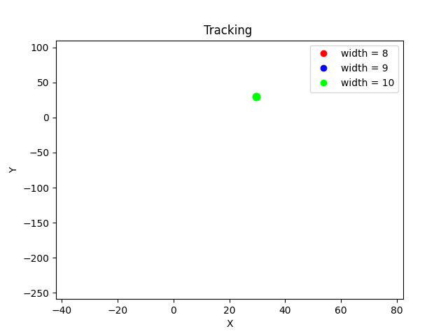
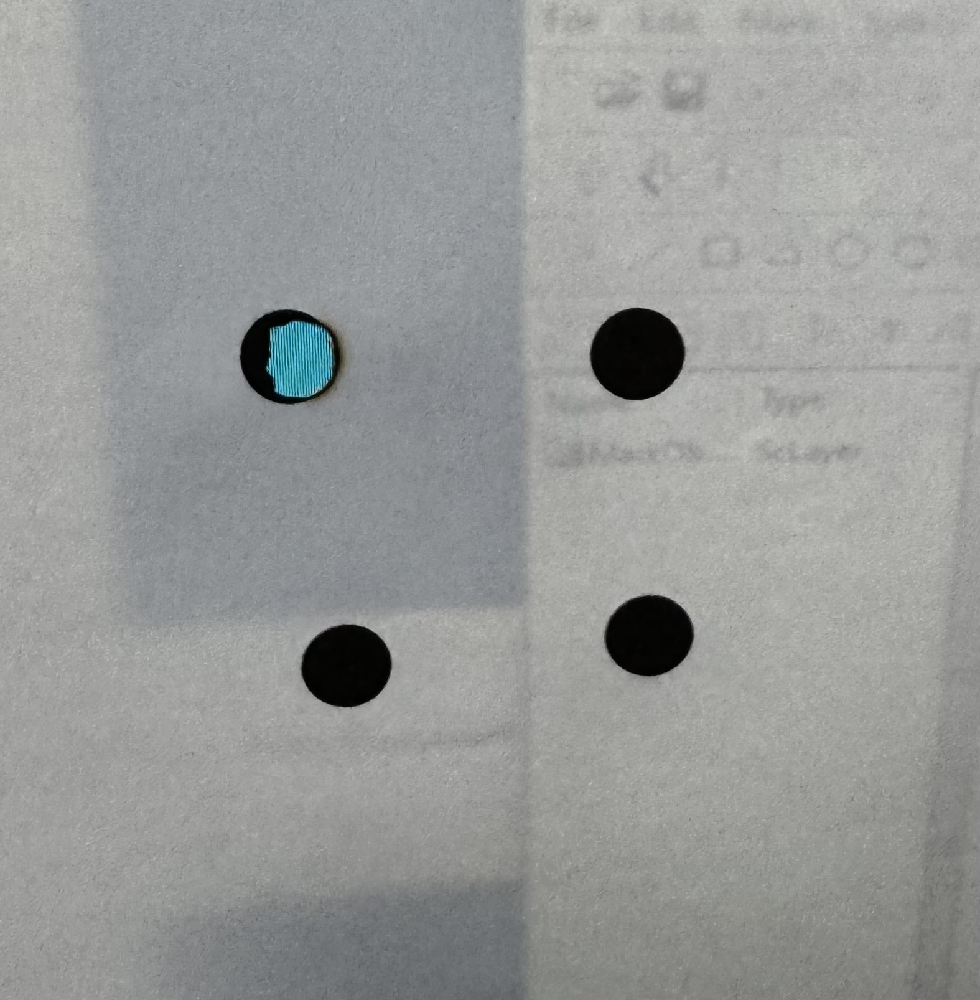

# Vision-Based-Laser-Targeting

A real-time vision-based laser targeting system using **Python/OpenCV** for circular target detection and **C# + SAMLight** for stable laser control.

## Overview

This project is not only a computer vision demo, but an end-to-end hardware integration system that connects real-time target detection, coordinate calibration, inter-process communication, and industrial laser control.

This project implements a **vision-guided laser targeting system** that detects circular targets from a live camera feed, transforms image coordinates into calibrated laser coordinates, and transmits the processed target position to a SAMLight-based laser controller.

The system was developed in a step-by-step workflow:

1. **Phase 1** – Camera test and vision validation  
2. **Phase 2** – Laser integration and real-time targeting  
3. **SAMLight Controller** – Dedicated C# controller for stable laser execution  

The final system separates:

- **Vision processing** in Python using OpenCV  
- **Laser control** in C# using SAMLight OCX / Client Control Interface  
- **Real-time communication** via TCP socket  

This modular architecture improves stability, avoids direct Python–COM issues, and reflects the practical constraints of industrial laser control software.

---

## Demo



The demo above shows real-time circular target detection and tracking using the camera-based vision pipeline.

## Experimental Setup


---

## System Architecture

Detailed architecture: [docs/system_architecture.md](docs/system_architecture.md)

Final system flow:

```text
Camera
   ↓
Python Vision Processing
   ├─ Circle detection
   ├─ Coordinate calibration
   ├─ Out-of-range filtering
   └─ Random single-target selection
   ↓
TCP Communication
   ↓
C# SAMLight Controller
   ↓
Laser Marking
```

---

## Project Structure

```bash
Vision-Based-Laser-Targeting/
├── docs/
│   ├── phase1_demo.gif
│   └── system_architecture.md
│
├── phase1_camera_test/
│   ├── logs/
│   ├── vision/
│   │   ├── calibration.py
│   │   ├── camera.py
│   │   ├── detect_circle.py
│   │   ├── entity.py
│   │   ├── entity_factory.py
│   │   ├── logger.py
│   │   └── transform.py
│   ├── main.py
│   └── requirements.txt
│
├── phase2_laser_integration/
│   ├── control/
│   │   └── laser_client.py
│   ├── vision/
│   │   ├── calibration.py
│   │   ├── camera.py
│   │   ├── detect_circle.py
│   │   ├── entity.py
│   │   ├── entity_factory.py
│   │   ├── logger.py
│   │   └── transform.py
│   ├── main_laser_tracking.py
│   └── requirements.txt
│
├── samlight_controller/
│   └── SamlightLaserController/
│       ├── WindowsFormsApp3/
│       │   ├── Program.cs
│       │   ├── Form1.cs
│       │   ├── Form1.Designer.cs
│       │   ├── Form1.resx
│       │   ├── WindowsFormsApp3.csproj
│       │   ├── App.config
│       │   ├── packages.config
│       │   └── Properties/
│       └── WindowsFormsApp3.sln
│
├── .gitignore
├── LICENSE
└── README.md
```

---

## Phase 1: Camera Test and Vision Validation

### Objective

Validate the vision pipeline independently before integrating the laser hardware.

### Implemented Features

- Camera connection and live video streaming  
- Circular target detection using OpenCV  
- Real-time target visualization  
- Coordinate normalization  
- Camera-to-laser coordinate calibration  
- CSV logging of calibration and tracking data  

### Result

The vision system successfully detected circular targets and produced calibrated coordinates without requiring laser hardware.

**Status:** ✅ Completed

### Run

```bash
pip install -r phase1_camera_test/requirements.txt
python phase1_camera_test/main.py
```

---

## Phase 2: Laser Integration and Real-Time Targeting

### Objective

Integrate the Python vision pipeline with the SAMLight laser control environment and validate the full real-time camera-to-laser targeting loop.

### Implemented Features

- Real-time transmission of transformed target coordinates from Python to C#  
- Continuous coordinate reception and execution in the SAMLight controller  
- End-to-end camera-to-laser targeting pipeline validation  
- Live laser targeting based on camera-detected circular targets  
- SAMLight integration through **C# WinForms + OCX**  
- Entity creation and marking test in SAMLight  

### Important Python-Side Improvements

To make the system stable in practice, the Python pipeline was modified to reflect real laser control constraints.

#### 1. Out-of-range coordinate rejection

Targets whose transformed coordinates fall outside the valid working range are discarded before transmission.

This prevents invalid commands from being sent to SAMLight and improves overall system stability.

#### 2. Random single-target transmission policy

Even if multiple circular targets are detected in a single frame, the Python side sends only **one target** at a time.

The target is selected **randomly** from the valid detected targets.

This was an intentional design choice because the SAMLight marking process takes approximately **1–2 seconds per target** in the current setup.  
Sending multiple targets continuously would create a mismatch between detection speed and actual marking speed.

For this reason, the system prioritizes **stable one-target-at-a-time execution** over raw multi-target throughput.

### Key Technical Decision

Direct Python control of SAMLight through COM was tested, but it was not stable enough for reliable operation.

Because of this, the project adopted the following structure:

```text
Python Vision
   ↓
TCP Socket
   ↓
C# SAMLight Controller
   ↓
Laser Hardware
```

This design significantly improved operational stability and matched the intended usage of the SAMLight control interface.

### Result

The full real-time vision-to-laser pipeline was successfully implemented and verified.

**Status:** ✅ Completed

### Run

```bash
pip install -r phase2_laser_integration/requirements.txt
python phase2_laser_integration/main_laser_tracking.py
```

---

## SAMLight Controller

The `samlight_controller/` directory contains the dedicated C# WinForms controller used to operate SAMLight reliably.

### Role

- Receive coordinates from Python through TCP  
- Interface with SAMLight through the OCX-based control environment  
- Execute stable marking commands on the laser hardware  

### Why a Separate Controller?

A dedicated C# controller provided significantly more stable hardware interaction than direct Python-side COM access and better matched the intended Windows-based SAMLight workflow.

---

## Technical Stack

### Vision Processing

- Python  
- OpenCV  
- NumPy  

### Laser Control

- C#  
- .NET WinForms  
- SAMLight OCX / Client Control Interface  

### Communication

- TCP socket communication between Python and C#  

---

## Engineering Notes

### Why not control SAMLight directly from Python?

Direct Python-side COM control was tested, but reliable operation was not achieved in practice.  
A dedicated C# controller provided much more stable interaction with SAMLight.

### Why reject out-of-range targets before transmission?

Filtering invalid coordinates on the Python side simplifies the system, reduces unnecessary communication, and helps avoid hardware-side errors.

### Why send only one randomly selected target at a time?

The camera can detect multiple targets much faster than the laser can physically complete a marking operation.  
Because one marking cycle takes about **1–2 seconds**, sending only one randomly selected valid target per cycle was a more stable and practical strategy.

---

## Experimental Result


Physical validation of the camera-to-laser targeting pipeline through real laser marking on the target surface.
The dark circular regions indicate material removal caused by laser marking, showing that the detected target coordinates were successfully transformed, transmitted to the SAMLight controller, and executed on a physical sample.

## Achievements

- Built a modular vision-guided laser targeting pipeline  
- Verified real-time circular target detection from live camera input  
- Implemented calibration from camera space to laser space  
- Established TCP-based communication between Python and C#  
- Integrated SAMLight through a dedicated C# controller  
- Added practical filtering logic for hardware-safe operation  
- Implemented random single-target selection for stable marking execution  
- Completed end-to-end real-time vision-guided laser targeting  

---

## Future Improvements

- Smarter target prioritization beyond random selection  
- Queue-based sequential marking logic  
- Faster end-to-end response  
- Improved calibration precision  
- Additional safety and arming logic  
- Expanded logging and GUI tools  

---

## Author

**Kyungwoo Lee**  
Undergraduate Student, Mechanical Engineering
